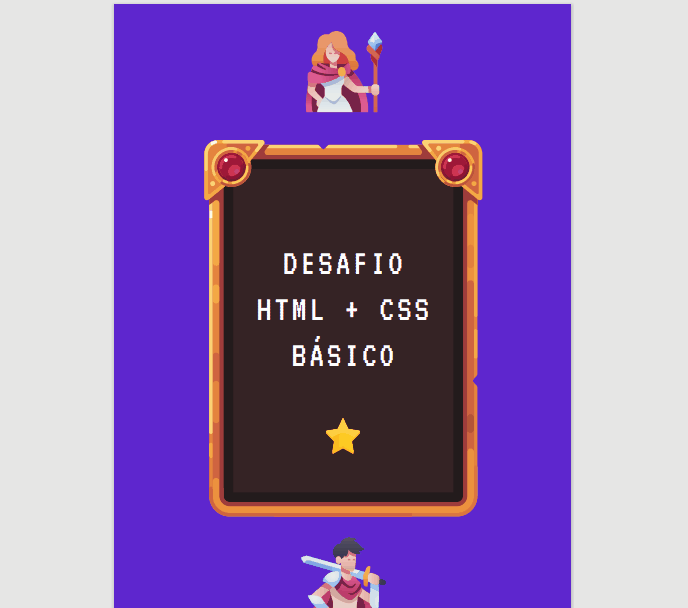

## Desafio HTML+CSS Básico Resolvido. DevQuest

Desafio do curso Dev Quest, para a criação de duas tabelas em HTML e estilizadas com CSS. (Cada uma com cores e estilos diferentes.)

[]

## Tecnologias Utilizadas
- HTML
- CSS